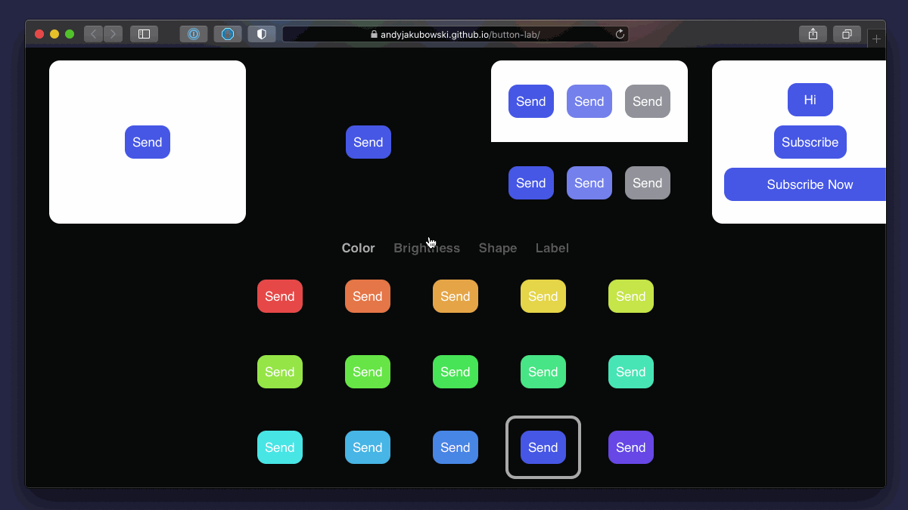

# Button Lab

Concept: easily create buttons that look good

## Try the demo

[https://andyjakubowski.github.io/button-lab/](https://andyjakubowski.github.io/button-lab/)

## Folder structure

[`dist`](dist) contains the lab demo.

[`python`](python) holds exported JSON data and the notebooks in which I trained and saved the Keras model.

## Twitter thread

My goal for this project was to see how we could direct our tools at a higher level instead of focusing on low-level details.

## License

Licensed under the [MIT License](LICENSE).
